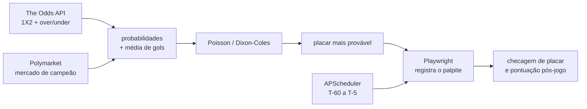

# bolão

[](https://www.python.org)
[](https://github.com/astral-sh/ruff)
[](https://mypy-lang.org)
[](https://docs.pytest.org)

Apostador automático para bolão de futebol. Estima o placar mais provável de cada
jogo com um modelo de Poisson/Dixon-Coles calibrado pelas odds de mercado,
registra o palpite no site por automação de navegador e refina a aposta a cada
nova rodada de odds até o apito inicial.

## Recursos

- **Modelo de placar**: Poisson independente com correção de Dixon-Coles para os
  placares baixos (0x0, 1x0, 0x1, 1x1).
- **Probabilidade de duas fontes**: odds 1X2 e over/under da The Odds API,
  ajustadas pela força relativa dos times no mercado de campeão do Polymarket.
- **Automação resiliente**: o Playwright faz login, localiza o jogo, registra e
  confere o palpite; cada falha é classificada para decidir entre nova tentativa
  e alerta manual.
- **Daemon agendado**: o APScheduler aposta em T-60 e refina o palpite em
  T-45/30/15/5 conforme novas odds chegam.
- **Estratégia por simulação**: Monte Carlo sobre os jogos restantes escolhe a
  política de palpite que maximiza a chance de terminar em primeiro.
- **Backtest sem vazamento**: Elo próprio calculado cronologicamente, comparado a
  um baseline de mercado e medido em pontos de bolão.
- **Notificações**: ciclo de vida da aposta no Telegram.

## Arquitetura



## Modelo

A distribuição de placares é uma Poisson independente por time, com a correção de
Dixon-Coles aplicada às quatro células de baixa contagem que a Poisson pura
subestima. O passo a passo:

1. As probabilidades 1X2 saem das odds, pela mediana entre as casas, com a margem
   removida pelo método da potência (que corrige o viés favorito-azarão melhor
   que a divisão proporcional).
2. A média total de gols (λ) vem da linha de over/under, resolvida por Brent.
3. λ é dividido entre casa e visitante de acordo com a probabilidade de vitória
   de cada um.
4. Monta-se a matriz de placares e aplica-se a correção de Dixon-Coles.
5. A aposta sugerida é a de maior valor esperado de pontos (3 para a cravada,
   1 para acertar só o resultado).

Em jogos de mata-mata, a matriz de 90 minutos é convoluída com a prorrogação
antes da escolha.

## Stack

| Camada | Bibliotecas |
|---|---|
| Modelo e simulação | scipy, numpy |
| Daemon | APScheduler |
| Automação e scraping | Playwright |
| HTTP e cache | httpx, diskcache |
| Logs | loguru |

## Instalação

```bash
uv sync
uv run playwright install chromium --with-deps
cp .env.example .env   # preencha com suas credenciais
```

## Configuração

Tudo que é específico do seu bolão fica no `.env` (veja `.env.example` para a
lista completa). As variáveis essenciais:

| Variável | Descrição |
|---|---|
| `ODDS_API_KEY` | chave da The Odds API |
| `ODDS_SPORT_KEY` | esporte/competição na The Odds API |
| `BOLAO_BASE_URL` | URL do site do bolão |
| `BOLAO_EMAIL` / `BOLAO_PASSWORD` | login no site |
| `BOLAO_SUBLEAGUE` | id da subliga onde você compete |
| `SUPABASE_URL` | backend do site (PostgREST) |
| `CC_API_URL` / `CC_TOKEN` | endpoint de notificação |

## Uso

```bash
# predição de um jogo, sem apostar
uv run python -m scripts.apostar_agora "Brasil" "Argentina" --apenas-predizer

# simulação de estratégia por Monte Carlo
uv run python -m scripts.simular --meus-pontos 8 --rival "João:10" --rival "Maria:7"

# daemon
uv run python -m bolao.agendador
```

## Backtest

O diretório `pesquisa/` contém um backtest sem vazamento de dados: um Elo
calculado cronologicamente (cada rating usa apenas jogos anteriores) é comparado
a um baseline de mercado e avaliado em pontos de bolão e em RPS (ranked
probability score) sobre a Copa de 2022. Os datasets são públicos e ficam
versionados em `pesquisa/dados/`, então o experimento é reproduzível offline.

## Testes e qualidade

```bash
uv run pytest tests/ -q
uv run ruff check bolao/
uv run mypy bolao/
```

## Deploy

Roda como serviço systemd em qualquer Linux. Há um unit de exemplo em
`deploy/bolao.service` (ajuste os caminhos e o usuário).

## Estrutura

```
bolao/        modelo, fontes de dados, automação, daemon
bolao/fontes/ The Odds API, Polymarket, scraping do site
scripts/      ferramentas de linha de comando
pesquisa/     backtest, Elo próprio e estudos de calibração
tests/        testes (pytest + respx)
```
